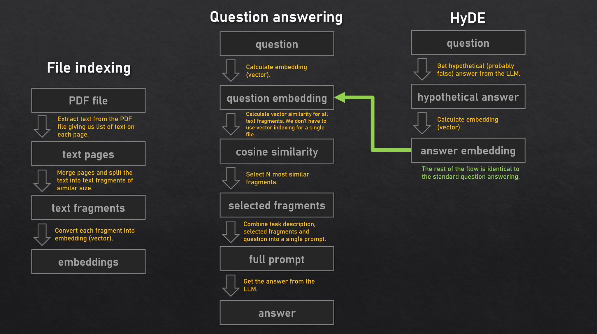
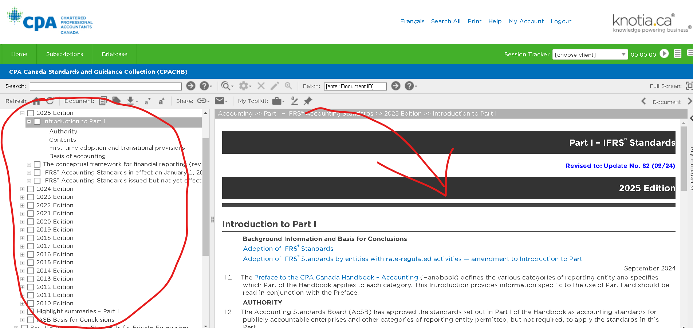
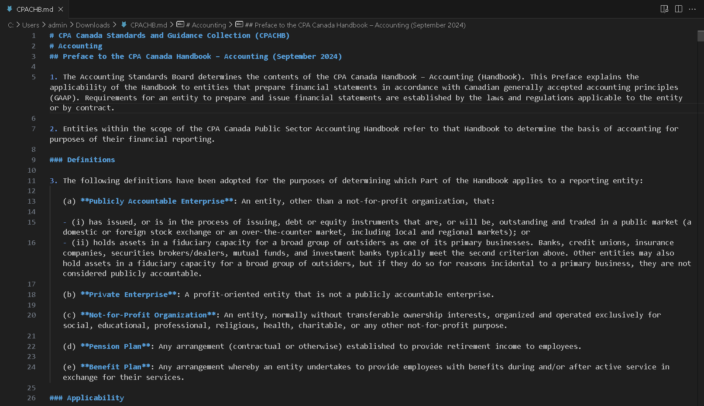

# KRP Database: a local storage solution for internal documentation that can handle natural-language questions

**KRP Database** uses an LLM like GPT-4 to process natural-language questions as queries to retrieve relevant snippets of data. The database converts the text into embeddings and generates a response. Please be aware that this is only a proof-of-concept system and may contain unfinished features.

## References

The database implements the following academic papers: In-Context Retrieval-Augmented Language Models aka **RALM**, Precise Zero-Shot Dense Retrieval without Relevance Labels aka **HyDE** 

## Pre-cursors

Development of our first solution required some tradeoffs, where only 2 out of 3 can occur.

1. Good (Robust and ready for deployment)
2. Nice (User-friendly experience)
3. Cheap (cost-effective)

Our goal is to eliminate redundant questions and unnecessary interactions between staff and senior management by providing a database, trained on all of the internal documentation we've developed throughout the years. The database is not a filter-based search, but rather a database capable of handling literal questions such us **"What is the disclosure requirement for a contingent loss?"** Such capability can only be achieved by incorporating a large language model (LLM), such as GPT-4.

**Huge disclaimer:** We as a team know that chatGPT can handle a lot of what we are trying to build, but pour 2 key differences are:

1. Sharing of private files - the KRP database runs locally, and the files are stored in a server that we set up. The incorporation of using an LLM in our database is possible thanks to the developer tools OpenAI created, which allows us to use their products, without relying on their servers for storage.

2. Erroneous information - at the core of all AI, it's just statistics behind. It does not create any new data but rather retrieves the most similar information based on its vector proximity. We eliminate this risk by creating our repository of data and fine-tuning our database with relevant material only.

## Database architecture

1. Server - We opted to use AWS due to the flexibility of deploying a private server within a few hours of set-up.
2. Domain - the domain name krp-database.com was secured for $20/yr and the DNS is managed by us.
3. Security - because this is a proof of concept system, no time was invested in security features.

## Training data

This version of KRP database has been fully trained on CPA Canada Handbook 2025 edition available on Knotia. The process of training the data is very straightforward:

1. Log in to knotia.ca

2. Copy/paste the data and convert it to markdown

3. Take the file.md and convert it to PDF. The file is now ready to be uploaded to KRP database.

